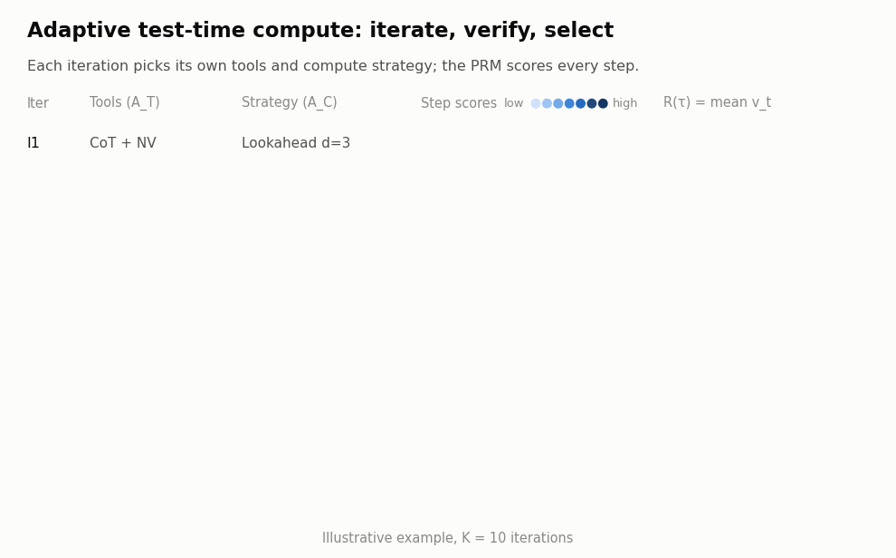
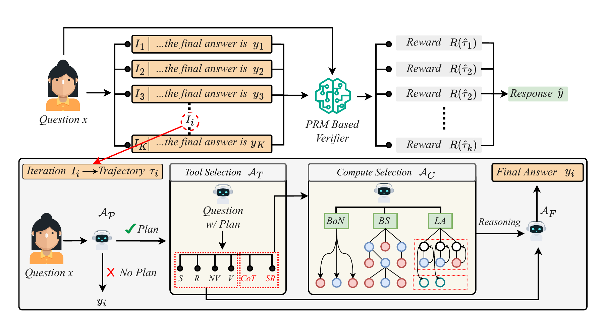
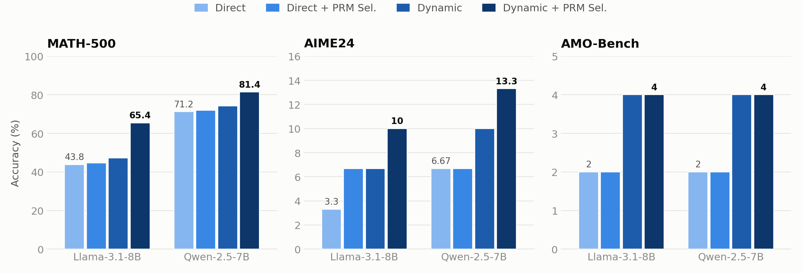

<div align="center">

# What If We Allocate Test-Time Compute Adaptively?

**Ahsan Bilal**<sup>†1</sup>, **Muhammad Ahmed Mohsin**<sup>†2</sup>, **Muhammad Umer**<sup>2</sup>, **Ali Subhan**<sup>3</sup>, **Hassan Rizwan**<sup>4</sup>, **Ayesha Mohsin**<sup>5</sup>, **Dean F. Hougen**<sup>1</sup>

<sup>1</sup>University of Oklahoma &nbsp; <sup>2</sup>Stanford University &nbsp; <sup>3</sup>Universitat Pompeu Fabra &nbsp; <sup>4</sup>University of California, Riverside &nbsp; <sup>5</sup>National University of Sciences and Technology
<br><sup>†</sup>Equal contribution

**ICML 2026**

[](https://arxiv.org/abs/2602.01070)
[](https://icml.cc/virtual/2026/poster/60797)

</div>

This is the official code for **"What If We Allocate Test-Time Compute Adaptively?"** (ICML 2026).

Standard test-time scaling spends the same compute on every problem and uses verification only to rerank finished answers. We instead treat reasoning as **iterative trajectory generation and selection**, guided by a verifier. For each problem, the agent runs $K$ iterations. In each iteration it optionally writes a plan, **selects reasoning tools**, **selects a compute strategy and exploration parameter**, and then generates a trajectory. A **process reward model (PRM)** is the shared control signal. Within an iteration, step-level scores drive pruning and expansion. Across iterations, the mean trajectory reward picks the final answer. The controller is **training-free**: every decision comes from role-specific prompts to the same base LLM.

<p align="center">
  <picture>
    <source media="(prefers-color-scheme: dark)" srcset="assets/pipeline_dark.gif">
    
  </picture>
</p>

<p align="center">
  
  <br>
  <em><b>Figure 1.</b> The agent generates K candidate trajectories, and a PRM scores them to select the response (top). Each iteration runs planning (A<sub>P</sub>), tool selection (A<sub>T</sub>), compute selection (A<sub>C</sub>), and answer extraction (A<sub>F</sub>) (bottom).</em>
</p>

---

## Main Results

Accuracy (%) with $K=10$ iterations and Qwen2.5-Math-PRM-7B as the verifier (Table 1 of the paper).

<p align="center">
  <picture>
    <source media="(prefers-color-scheme: dark)" srcset="assets/results_dark.png">
    
  </picture>
</p>

| Dataset | Setting | Llama-3.1-8B-Instruct | Qwen-2.5-7B-Instruct |
|---|---|:---:|:---:|
| **MATH-500** | Direct | 43.8 | 71.2 |
| | + PRM Sel. | 44.6 | 72.0 |
| | Dynamic | 47.2 | 74.2 |
| | **Dynamic + PRM Sel.** | **65.4** | **81.4** |
| **AIME24** | Direct | 3.3 | 6.67 |
| | + PRM Sel. | 6.67 | 6.67 |
| | Dynamic | 6.67 | 10.0 |
| | **Dynamic + PRM Sel.** | **10.0** | **13.3** |
| **AMO-Bench** | Direct | 2.0 | 2.0 |
| | + PRM Sel. | 2.0 | 2.0 |
| | Dynamic | 4.0 | 4.0 |
| | **Dynamic + PRM Sel.** | **4.0** | **4.0** |

On MATH-500 with Qwen-2.5-7B, the best fixed tool/strategy configuration also reaches 81.4%, but it needs a much higher compute intensity. For example, CoT Beam Search ($p=10$, $I=10$) uses $1.38\times10^{14}$ FLOPs per problem and $S_{CI}=8.32\times10^{-3}$. The adaptive agent reaches the same accuracy without per-dataset tuning (Section 4.3 and Appendix A.2).

---

## Paper-to-Code Map

| Paper component | Code |
|---|---|
| Planning agent $\mathcal{A}_P$ | `UniversalAgent._make_plan` in [`src/universal_agent.py`](src/universal_agent.py) |
| Tool selection agent $\mathcal{A}_T$ | [`src/help_functions/tool_selector.py`](src/help_functions/tool_selector.py) |
| Compute selection agent $\mathcal{A}_C$ (strategy $c$, parameter $m$) | [`src/help_functions/compute_selector.py`](src/help_functions/compute_selector.py) |
| Compute strategies: Best-of-N, Beam Search, Lookahead | [`src/help_functions/compute_strategies.py`](src/help_functions/compute_strategies.py) |
| Reasoning tools: CoT, Self-Reflection | [`cot_reasoner.py`](src/help_functions/cot_reasoner.py), [`self_reflection.py`](src/help_functions/self_reflection.py) |
| Auxiliary tools: Numeric Verifier, Verifier, Summarizer, Reframer | [`src/help_functions/tools.py`](src/help_functions/tools.py) |
| Step scoring inside a strategy (PRM scoring prompt, App. B.6) | [`src/help_functions/prm_model.py`](src/help_functions/prm_model.py) |
| Answer extraction agent $\mathcal{A}_F$ | `UniversalAgent._extract_final_answers` in [`src/universal_agent.py`](src/universal_agent.py) |
| Inter-iteration selection with Qwen2.5-Math-PRM-7B (Eq. 1–2) | [`src/help_functions/prm_selector.py`](src/help_functions/prm_selector.py) |
| Multi-iteration evaluation loop | `evaluate_reasoning_agent` in [`main.py`](main.py) |
| All prompts (Appendix B) | [`src/help_functions/prompts_templates.py`](src/help_functions/prompts_templates.py) |
| Answer checking (Satori protocol) | [`src/Evaluator.py`](src/Evaluator.py), [`src/help_functions/math_toolkit/`](src/help_functions/math_toolkit) |
| Datasets: MATH-500, AIME24, AMO-Bench | [`src/math_core.py`](src/math_core.py) |
| Compute metrics $F_\text{theo}$ and $S_\text{CI}$ | [`compute_cost.py`](compute_cost.py) |
| Fixed-configuration ablations (Tables 2, 5, 6, 9) | [`run_ablation.sh`](run_ablation.sh), [`run_ablation_qwen.sh`](run_ablation_qwen.sh) |
| Tool and strategy usage plots (Figure 3) | [`make_csv_from_results.py`](make_csv_from_results.py) |

---

## Repository Structure

```
.
├── main.py                        # Evaluation entry point (all settings in the paper)
├── config.yaml                    # Main config; commented blocks show each mode
├── ablation_config.yaml           # Example fixed tool + compute config
├── run_ablation.sh                # 36-config ablation grid (Llama, Ollama client)
├── run_ablation_qwen.sh           # 36-config ablation grid (Qwen, Transformers client)
├── compute_cost.py                # F_theo and S_CI for finished runs
├── make_csv_from_results.py       # Tool/strategy usage plots from run outputs
├── configs/                       # Mode presets: direct, dynamic, fixed tool, fixed compute
├── src/
│   ├── universal_agent.py         # Adaptive agent (A_P, A_T, A_C, A_F)
│   ├── math_core.py               # MATH-500 / AIME24 / AMO-Bench loaders and wrappers
│   ├── gsm8k_core.py              # GSM8K loader and wrapper
│   ├── Evaluator.py               # Answer extraction and equivalence
│   ├── help_functions/            # Selectors, reasoners, strategies, tools, PRM, prompts
│   ├── dataset_generation/        # Rollout collection (optional learned controller)
│   └── trainer_files/             # SFT/DPO controller training (optional, not in paper)
├── training_main.py               # Optional learned-controller training entry point
├── main_trajectory_generator.py   # Optional rollout generation entry point
├── assets/                        # README figures (make_figures.py regenerates them)
└── BALROG/                        # LLM client wrappers (adapted from BALROG)
```

---

## Installation

We tested with Python 3.10+ and a single NVIDIA RTX 5090 (32 GB).

```bash
git clone https://github.com/AhsanBilal7/hierarchical_gate_reason.git
cd hierarchical_gate_reason

conda create -n adaptive-ttc python=3.10 -y
conda activate adaptive-ttc

# PyTorch: pick the build for your CUDA version from https://pytorch.org
pip install torch

pip install -r requirements.txt
pip install transformers accelerate bitsandbytes omegaconf numpy sympy pydantic \
            matplotlib seaborn openai anthropic google-generativeai
```

`main.py` imports the client from `BALROG/balrog/client.py` directly, so you do **not** need to install the BALROG environments. Run every command from the repository root.

The Llama models on Hugging Face are gated. Log in first:

```bash
huggingface-cli login
```

Datasets download automatically from the Hugging Face Hub:

| `--dataset` | Hub dataset | Split used |
|---|---|---|
| `math` | `HuggingFaceH4/MATH-500` | `eval.split` (`test`) |
| `aime24` | `Maxwell-Jia/AIME_2024` | `train` (the only split) |
| `amo` | `meituan-longcat/AMO-Bench` | `eval.split`, or the first available split |
| `gsm8k` | `openai/gsm8k` (`main`) | `eval.split` |

---

## Quick Start

Run the full adaptive agent (**Dynamic + PRM Selection**) on MATH-500 with the default `config.yaml`:

```bash
python main.py --config config.yaml --dataset math
```

Each run writes three files to `eval.output_dir`:

| File | Contents |
|---|---|
| `*_results_live.csv` | One row per iteration, written as the run progresses: prediction, correctness, tools, strategy, PRM rewards |
| `*_results_final.json` | Aggregate statistics plus every iteration of every problem (reasoning, steps, plan, metadata) |
| `*_pathway.json` | Per-problem decision path: tools, compute configs, plan, PRM scores, selected iteration |

---

## Configuration

A run is defined by three sections of a YAML config.

**`client`**: the base LLM. The same model serves as reasoner and as controller.

```yaml
client:
  client_name: transformer            # transformer | ollama | vllm | openai | gemini | claude
  model_id: Qwen/Qwen2.5-7B-Instruct  # or meta-llama/Llama-3.1-8B-Instruct
  generate_kwargs:
    temperature: 0.7                  # paper setting: T = 0.7, top-p = 0.9, 1024 tokens
    top_p: 0.9
    max_tokens: 1024
  timeout: 60
  max_retries: 5
  delay: 2
  alternate_roles: false
```

With `client_name: ollama`, set `base_url: http://localhost:11434/v1` and use an Ollama tag such as `qwen2.5:7b-instruct`. The Transformers client also accepts `load_in_8bit: true` or `load_in_4bit: true` if GPU memory is tight.

**`agent`**: which components are active. **`eval`**: dataset slice, iteration count, and output folder.

```yaml
eval:
  output_dir: results/dynamic_prm_qwen_math
  num_iterations: 10          # K. PRM selection is enabled automatically when K > 1
  prm_selection_metric: mean_reward
  max_problems: null          # null = full dataset
  split: test
  problem_types: null         # e.g. ["Algebra", "Geometry"] (MATH-500 subjects)
  difficulty_levels: null     # e.g. [1, 2, 3] (MATH-500 levels)
```

> **Note:** `main.py` turns on PRM-based selection whenever `num_iterations > 1` and turns it off otherwise. The `--no-prm` flag has no effect. Ready-made presets are in `configs/`: `config_direct.yaml` ($K=1$), `config_dynamic.yaml`, `config_fixed_tool.yaml`, and `config_fixed_compute.yaml` ($K=10$). They use the Ollama client and `max_problems: 120`; set `max_problems: null` to run the full dataset.

---

## Reproducing the Paper

### Main settings (Table 1, Figures 2–4)

Each paper setting maps to the agent flags and $K$ below. All other fields stay as in the config above.

| Setting | `use_planner` | `use_tool_selector` | `use_compute_selector` | `num_iterations` |
|---|:---:|:---:|:---:|:---:|
| Direct | `false` | `false` | `false` | 1 |
| Direct + PRM Sel. | `false` | `false` | `false` | 10 |
| Dynamic | `true` | `true` | `true` | 1 |
| Dynamic + PRM Sel. | `true` | `true` | `true` | 10 |

For all four, set `fixed_tool: null` and `fixed_compute: null`. Set `mode` to a short label such as `direct` or `dynamic`; it is used in output filenames.

```bash
python main.py --config <your_config>.yaml --dataset math     # MATH-500
python main.py --config <your_config>.yaml --dataset aime24   # AIME24
python main.py --config <your_config>.yaml --dataset amo      # AMO-Bench
```

### Fixed-configuration ablations (Tables 2, 5, 6, 9)

The fixed baselines apply one tool, one compute strategy, and one parameter to every problem:

```yaml
agent:
  mode: fixed_tool_compute
  use_planner: false
  use_tool_selector: false
  use_compute_selector: false
  fixed_tool: cot               # cot | self_reflection
  fixed_compute:
    strategy: best_of_n         # best_of_n | beam_search | lookahead
    param: 5                    # N, beam width k, or lookahead depth d
```

The ablation scripts sweep tools {CoT, Self-Reflection} × strategies {Best-of-N, Beam Search, Lookahead} × $p \in \{1, 5, 10\}$ × $I \in \{1, 5, 10\}$. They generate one config per combination and run the jobs in parallel:

```bash
bash run_ablation.sh        # Llama-3.1-8B via Ollama
bash run_ablation_qwen.sh   # Qwen-2.5-7B via Transformers
```

Edit `DATASET`, `MAX_PARALLEL`, and the `FILTER_*` variables at the top of each script to choose the dataset, the parallelism, or a subset of the grid. Configs go to `configs_ablation*/`, logs go to `logs_ablation*/`, and results go to one `fixed_tool_compute_*` folder per run.

### Compute cost: $F_\text{theo}$ and $S_\text{CI}$ (Figures 4–5, Tables 5–6)

`compute_cost.py` reads each `*_results_final.json` and computes

$$
S_\text{CI} = \frac{\bar G_\text{base}\,\bar T_\text{base}\,(1+\alpha \bar C)}{\kappa},\qquad
F_\text{theo} = 2\,M\cdot\min(\bar T_\text{total}, L_\text{ctx})\cdot \bar G,
$$

with $\alpha = 0.1$ and $\kappa = 10^6$. When PRM selection is on, only the iterations up to the selected one are counted.

Put your run folders under one parent directory, set `parent_dir` and `model_config` (`model_parameters`, `context_length`) in the `__main__` block, then run:

```bash
python compute_cost.py
```

The script writes a metrics JSON next to each results file and prints a summary table.

### Tool and strategy usage (Figure 3, Table 7)

```bash
python make_csv_from_results.py \
    --pathway_file <output_dir>/math_mode-dynamic_planner-True_toolsel-True_computesel-True_pathway.json \
    --output_dir visualizations \
    --num_samples 5
```

---

## Evaluation Protocol

- **Answer checking.** We follow the math evaluation code and protocol of [Satori](https://github.com/Satori-reasoning/Satori). The final `\boxed{}` answer is extracted and compared with the gold answer by exact match or symbolic equivalence (`src/Evaluator.py`).
- **Verifier.** Inter-iteration selection uses [`Qwen/Qwen2.5-Math-PRM-7B`](https://huggingface.co/Qwen/Qwen2.5-Math-PRM-7B) with greedy scoring. Each trajectory's reward is the mean of its step rewards, $R(\tau)=\frac{1}{T}\sum_t v_t$.
- **Decoding.** The base model samples with $T=0.7$, top-$p=0.9$, and at most 1024 new tokens.
- **Runs.** The main tables report single-run accuracy.

---

## Optional: Learned Controller (not used in the paper)

The paper's controller is **training-free**. The repository also contains experimental code for distilling the controller's tool and strategy decisions into a fine-tuned model (SFT followed by preference optimization). **None of the paper's results use it.**

```bash
python main_trajectory_generator.py --config main_trajectory_config.yaml   # collect rollouts
python training_main.py --config training_config.yaml --stage all          # preferences -> SFT -> DPO -> evaluate
```

This path needs extra packages: `pip install peft trl datasets wandb`.

---

## Citation

If you find this work useful, please cite:

```bibtex
@inproceedings{bilal2026allocate,
  title     = {What If We Allocate Test-Time Compute Adaptively?},
  author    = {Bilal, Ahsan and Mohsin, Muhammad Ahmed and Umer, Muhammad and Subhan, Ali and Rizwan, Hassan and Mohsin, Ayesha and Hougen, Dean F.},
  booktitle = {Proceedings of the 43rd International Conference on Machine Learning},
  series    = {Proceedings of Machine Learning Research},
  volume    = {306},
  year      = {2026}
}
```

## Acknowledgements

This project builds on [BALROG](https://github.com/balrog-ai/BALROG) (LLM client wrappers), the [Satori](https://github.com/Satori-reasoning/Satori) math evaluation code, the [Xwin-Math](https://github.com/Xwin-LM/Xwin-LM) / [ToRA](https://github.com/microsoft/ToRA) LaTeX grader, and [Qwen2.5-Math-PRM](https://huggingface.co/Qwen/Qwen2.5-Math-PRM-7B). We thank their authors for releasing their work.

## License

Released under the MIT License. The code in `BALROG/` keeps its original license ([`BALROG/LICENSE`](BALROG/LICENSE)).

## Contact

For questions, please open an issue or email Ahsan Bilal at ahsan.bilal-1@ou.edu.
